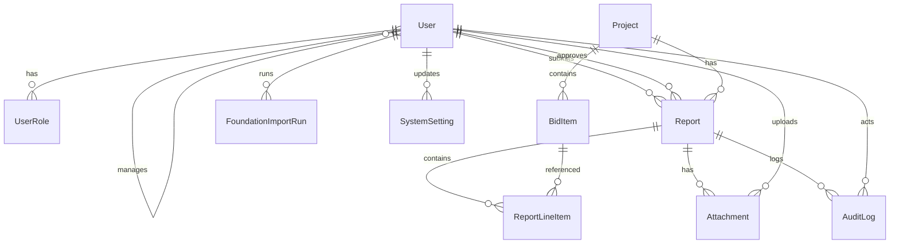

# Database Structure — Field Reporting System

Aligned to FRD §11 (Data Requirements), roles/permissions, and Phase 1 CSV Foundation import.

## ER overview



## Tables (Prisma models)

| Model | FRD | Purpose |
|-------|-----|---------|
| `User` / `UserRole` | §7 | Auth, roles, division, manager assignment (routing) |
| `Project` | §11.1 | Active jobs from Foundation CSV / manual |
| `BidItem` | §11.2 | Contract items + form type flag |
| `Report` | §11.3 | Daily report lifecycle |
| `ReportLineItem` | §11.4 | STA / Single Location / Manual footage lines |
| `Attachment` | §11.5 | Tickets, photos, certifications |
| `AuditLog` | §11.6 | Immutable lifecycle events |
| `FoundationImportRun` | §12.3 | CSV import history + last-run stats |
| `SystemSetting` | — | Key/value system config |

## Report status

`DRAFT` → `SUBMITTED` → `RETURNED` | `APPROVED` | `APPROVED_WITH_NOTES`  
`RETURNED` → (edit) → `SUBMITTED`

## Quantity rules (line items)

| `entryType` | Required fields | `quantitySource` |
|-------------|-----------------|------------------|
| `STA_RANGE` | beginSta, endSta, conversionFactor, calculatedLf | `STATION_CALCULATED` |
| `MANUAL_FOOTAGE` | manualLf | `MANUAL` |
| `SINGLE_LOCATION` | location/symbol + finalQuantity | usually `MANUAL` |

`finalQuantity` is always required (BR-007 tagging via `quantitySource`).

## Indexes (hot paths)

- Project search: `jobNumber`, `name`, `status`
- Manager queue: `Report(status, submittedAt)`, `division + status`
- Admin rollup: `projectId + status`
- Bid items: `projectId + itemNumber` unique

## Package

```
packages/db/
  prisma/schema.prisma
  prisma/seed.ts
  src/index.ts
  .env.example
```

## Setup

```bash
cd packages/db
cp .env.example .env
# set DATABASE_URL
npm install
npx prisma migrate dev --name init
npm run db:seed
```

Schema source: `packages/db/prisma/schema.prisma`
